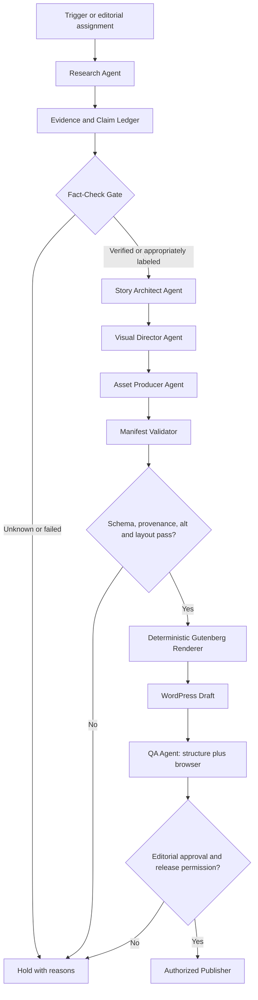

# HYBRID MIND — Visual-First A2A Publishing Architecture V0.1

**Date:** 2026-10-09  
**Product:** Hybrid Mind — Modern AI Lifestyle  
**Primary site:** https://hybridmind.online (WordPress.com Atomic / Assembler)  
**Repo:** https://github.com/nustanakritwithai/HybridMind-  
**Rule:** UNKNOWN ≠ PASS  
**Release:** ARCHITECTURE / PROTOTYPE — NOT an activated unattended publishing service.

## 1. Product decision

Hybrid Mind articles are **visual experiences**, not a traditional sequence of prose paragraphs that a human must decorate manually. A2A agents generate a portable, validated **Visual Article Manifest** that a deterministic renderer converts into Gutenberg blocks. WordPress remains the secure CMS and editor-of-record; agents do not individually click and edit block layouts.

- Visual-first does not mean decorating unsourced assertions. The correct visual grammar depends on the underlying content: process → flow, tradeoffs → comparison, decisions → decision cards, sequence → timeline, definitions → annotated diagram, evidence → sourced data chart.
- Aim for a summary visual in the first screen and a relevant visual module between long narrative sections. Do not force a chart without quantitative evidence.
- Preserve a useful text alternative for every graphic and make source links inspectable.
- Keep the existing Assembler theme, homepage, Typhoon Chat and all published posts unchanged while prototyping.
- **Authoring can be hands-off; publishing still requires review and a recorded authorization.** Agents may save Drafts repeatedly. Do not auto-publish while editorial, safety and launch gates remain open.

## 2. A2A work graph



Agents are **roles**, not necessarily distinct AI subscriptions. A single orchestrator may run multiple roles, but handoff artifacts must be recorded separately for traceability. A formal interoperable A2A transport adapter can be added later; V0.1 uses versioned JSON task envelopes (an A2A-ready contract), **not** a claim of fully deployed Agent2Agent protocol infrastructure.

## 3. Agent contracts and permissions

| Agent role | Input | Output | Permissions |
| --- | --- | --- | --- |
| Intake / Scheduler | Approved topic rules, cadence, duplicate ledger | Task envelope | Create research tasks only |
| Researcher | Topic + trusted sources | Source cards, excerpts, date, provenance | Read public sources only |
| Fact Checker | Source cards and claims | Claim Ledger with `verified`, `claim`, `unknown`, `opinion` | May block misleading assertions |
| Story Architect | Verified claims, user-supplied essays | Structured narrative and visual story map | May not publish |
| Visual Director | Story map, claim status, images | Typed visual modules, alt text and descriptions | May not invent numbers |
| Asset Producer | Approved image briefs | Image asset IDs, licenses, source notes | Upload to Media Library Draft assets only |
| Renderer | Validated manifest | Gutenberg block markup + manifest digest | No direct model-to-HTML |
| QA Agent | WP Draft, images, structured data, browser | PASS/FAIL/UNKNOWN report, errors | Read and recommend revisions |
| Publisher | Explicit approval, all gates, digest | Publish action / event log | Least-privilege WordPress publishing role |

Important privilege separation: **no third-party AI receives WordPress administrator credentials, Typhoon API key, draft content beyond the approved task, or publish/delete privileges.** A bounded WordPress service identity writes Drafts only. Admin or authorized editorial approver controls publication.

## 4. Visual Article Manifest (single source of truth)

The manifest conforms to `contracts/visual-article-v1.schema.json`. It includes:

- Identity: `schema_version`, `article_id`, `title`, `slug`, `category`, `language`, `source_post_id`, `status=draft`.
- Editorial: `dek`, `audience`, `editorial_type`, `claim_ledger` with statuses and source IDs, `sources`.
- Media: WordPress media ID, external asset provenance/rights, alt text, caption; generated images must be labeled when relevant.
- Sequence of typed modules: `summary`, `comparison`, `process`, `quote`, `decision`, `checklist`, `narrative`. Other types require a new validated schema version, not arbitrary HTML.
- Lifecycle: `qa_status`, `editorial_status`, `visual_status`, `approved_digest`; no published status is inferred from generation alone.

**Data flow is one-way:** Model JSON → schema/fact/URL validation → deterministic renderer → Gutenberg Draft. Gutenberg markup is an output format, not an AI-designed freeform input.

## 5. Default visual language / design tokens

- Tone: credible Thai technology editorial, not noisy shopping banners. Brand identity: `HYBRID MIND / LIVE SMARTER. LIVE FUTURE.`
- Palette: Navy `#14243b`, dark charcoal `#1e1e1e`, cyan `#0693e3`, white `#fff`, mist `#e8f4fb`. In Gutenberg prefer Assembler theme tokens when appropriate.
- Composition: strong featured image or explanatory illustration; visual overview; structured comparison; contextual story; decision aid; 3–6 visuals when the content warrants them.
- Mobile first: flexible columns stack, no fixed-width labels, text >= 16px for reading, buttons >=44px target, and no nested scrolling in charts/cards.
- Alternative representations: every image has useful alt text, every chart has a text summary and named sources, every icon has descriptive accompanying text.
- Source confidence: label `ข้อมูลจากผู้ขาย`, `ผ่านการตรวจสอบ`, `ข้อสังเกต`, or `ยังไม่ยืนยัน` based on facts, not visual polish.
- Explicitly avoid fake live-news indicators, fabricated metrics, AI-generated product photographs presented as original, and fake screenshots.

## 6. Visual module semantics

| Module | Use when | Mandatory information |
| --- | --- | --- |
| `summary` | What must be understood in 10 seconds? | 2–5 key points |
| `comparison` | 2–4 options have different tradeoffs | Named options, use case, advantage, limitation |
| `process` | There is a causal or operational sequence | Ordered stages and text descriptions |
| `decision` | Reader needs to select a tool or route | Condition, recommendation, disclaimer if needed |
| `checklist` | Repeatable validation or next actions | Explicit actionable checkpoints |
| `quote` | Central editorial insight | Attribution / author context |
| `narrative` | Nuance, source quotes, story and explanation | Structured headings and paragraphs |
| `image` (planned V0.2) | Evidence or explanation requires artwork | Media ID, alt, caption, ownership, source ID |

A2A agents should interleave prose and visuals; **repetition of blocks alone is not visualization**.

## 7. Editorial release states

`DISCOVERED → EVIDENCE_READY → VERIFIED → STORYBOARDED → ASSET_READY → DRAFT_RENDERED → QA_READY → APPROVED → PUBLISHED`

Any of the following produces HOLD/FAIL: unspecified source for an asserted current price, contradictory claim ledger, inaccurate product representation, duplicate post, unsafe/unlicensed media, inaccessible visualization, output HTML injection, failed WordPress readback, missing browser viewport evidence, or absent approval.

For AI-generated general education articles, agent QA may move a Draft to `QA_READY`. **It may not call `posts.update status=publish` without explicit editorial approval.** During Hybrid Mind's prelaunch stage all public-launch actions remain separate.

## 8. A2A envelope example

```json
{
  "protocol": "hybridmind-article-a2a/0.1",
  "task_id": "hm-2026-10-game-tools-001",
  "trace_id": "same-id-across-handoffs",
  "stage": "visual-director",
  "input_artifact": "manifests/ai-game-tools.visual.json",
  "input_sha256": "<resolved-by-runner>",
  "output_artifact": "rendered/ai-game-tools.gutenberg.html",
  "decision": "HOLD",
  "reason": "Waiting for browser screenshots and editorial approval"
}
```

Runner must compute real hashes, reject stale versions and duplicate idempotency keys, record timestamps and never interpret placeholder hashes as verified evidence.

## 9. WordPress integration plan

**Phase V0.1 (this sprint):** Define the schema, A2A agent contracts, renderer module and one Draft prototype based on existing owner-written Post #52. Keep Post #52 as published source; do not rewrite or alter its byline. Do not publish the prototype.

**Phase V0.2:** Add a server-side publisher adapter (least-privilege REST application credential stored only in server secrets) to create/update Drafts idempotently by `external_article_id`. Verify WordPress readback after every write and store source manifest digest.

**Phase V0.3:** Investigate Uncanny Automator v7.7.0 as a trigger (installed does not prove any recipe is configured) and/or a scheduled worker. Inputs may come from RSS, curated editorial topics or submitted user essays. Scheduling cadence must be chosen and approved before activation.

**Phase V0.4:** Optional custom WordPress plugin registers `hm/visual-article` blocks or a secure server-side renderer to support interactive comparisons, timelines and source-linked data charts. Do not inject arbitrary AI HTML/JS into WordPress pages; use vetted block modules.

**Phase V1:** Multiple article categories, runtime monitoring, queue backoff, review dashboard and publication audit log. Only then consider carefully bounded auto-publish, if separately authorized.

## 10. Acceptance criteria

- A fresh article can be produced from a manifest **without a human manually arranging Gutenberg blocks**.
- Every visual module survives a WordPress Draft save/readback, and its factual statements remain traceable.
- The same renderer reproduces equivalent output for the same manifest and version.
- At least 320, 375/390, 768 and 1280 CSS-px signed-in preview views are checked; **no full Visual QA PASS from block markup alone**.
- New Draft does not change the original post, theme or homepage; Coming Soon remains in place.
- AI generation and WP Draft creation can eventually be automated with explicit account authorization. **Automation/deployment is UNKNOWN until tested.**

## 11. First pilot article

Use owner-authored WordPress Post **#52** (*บทเรียนจากการสร้างเกมด้วย AI: AI เก่งแค่ไหน ก็ต้องใช้เครื่องมือให้ถูกงาน*) as the read-only reference. Proposed visual modules:

1. Hero image + one-screen summary about "Right tools".
2. Four tool choice cards (HTML/JavaScript, Godot, Unreal Engine, Blender).
3. Tradeoff comparison cards with suitability and limitations.
4. Workflow progression illustrating tool selection and structured AI work.
5. A decision guide: which tool for each project?
6. Checklist and prominent concluding quote.
7. Preserve the original essay in accessible narrative sections, not just a graphic summary.

The owner-authored article is first-person experience. A future model-generated article must **not** impersonate the owner or invent their experiences.

## 12. Current gate

**ARCHITECTURE READY FOR PROTOTYPE / AUTOMATED A2A TRANSPORT NOT DEPLOYED / WORDPRESS DRAFT PREVIEW PENDING / PUBLIC LAUNCH HOLD.**

Reference: [Project Control](../PROJECT_CONTROL.md). Retain all historical R1/R2/R4 gates and documented exceptions; this work does not overwrite them.
